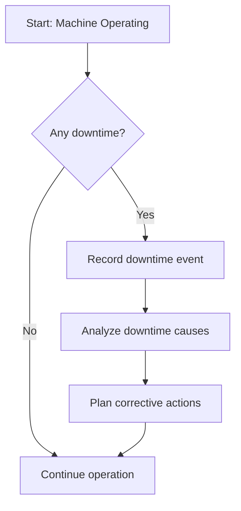
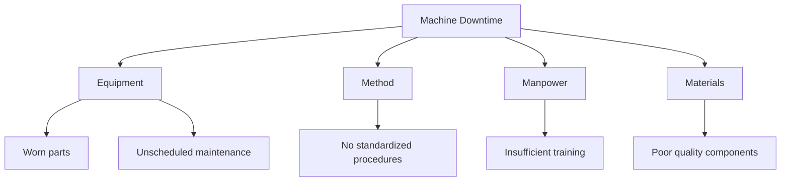

# Lean A3 Report Preparation Guide

Lean A3 is a structured problem-solving tool that fits on a single A3 sheet. It helps teams analyze issues deeply and implement effective solutions.

---

## 1. What is an A3 Report?

- A concise, visual problem-solving report.

- Supports root cause analysis.

- Improves team alignment.

---

## 2. Core Sections of an A3 Report

- **Title:** Problem or project name
- **Current Condition:** Data-driven current state summary
- **Target Condition:** Desired future goal
- **Root Cause Analysis:** Identified root causes
- **Countermeasures:** Proposed solutions
- **Action Plan:** Implementation steps
- **Implement and Monitor:** Track progress regularly
- **Measure and Record Results:** Collect post-implementation data
- **Lessons Learned:** Key takeaways

  

## 3. Example Process Flow (Current Condition)

4. Root Cause Analysis Example (Fishbone Diagram)

## 5. Steps to Prepare an A3 Report

Preparing an effective A3 report involves a clear, structured approach to problem-solving. Follow these steps carefully:

### 5.1 Define the Problem (Title)
- Write a concise, clear problem statement.
- Focus on a specific issue that can be addressed.
- Avoid vague or overly broad descriptions.

### 5.2 Describe the Current Condition
- Collect and present objective data.
- Use charts, process maps, or photos if available.
- Describe what is actually happening, not what you think is happening.
- Be factual and avoid assumptions.

### 5.3 Set the Target Condition
- Define measurable goals.
- Set a realistic but challenging target.
- Explain why achieving this target is important for the business or team.

### 5.4 Conduct Root Cause Analysis
- Use structured methods like:
  - **5 Whys**: Ask “Why?” repeatedly until the root cause is found.
  - **Fishbone Diagram**: Categorize possible causes (e.g., Man, Machine, Method, Material).
- Avoid focusing only on symptoms; dig deeper.

### 5.5 Develop Countermeasures (Solutions)
- Brainstorm potential solutions addressing root causes.
- Evaluate each solution for impact and feasibility.
- Select the best combination of actions to implement.

### 5.6 Create an Action Plan
- Assign responsibilities: Who will do what?
- Set clear deadlines and milestones.
- Identify required resources and support.
- Include follow-up and review points.

### 5.7 Implement and Monitor
- Execute the action plan.
- Track progress regularly.
- Adjust plan as necessary based on feedback.

### 5.8 Measure and Record Results
- Collect post-implementation data.
- Compare actual results with the target condition.
- Visualize improvements with graphs or charts.

### 5.9 Reflect and Document Lessons Learned
- Analyze what worked well and what didn’t.
- Identify opportunities for further improvement.
- Share insights with the team to build knowledge.

---

> 🧠 Keep diagrams simple and readable.
> 🧠 Combine diagrams with concise text explanations.
